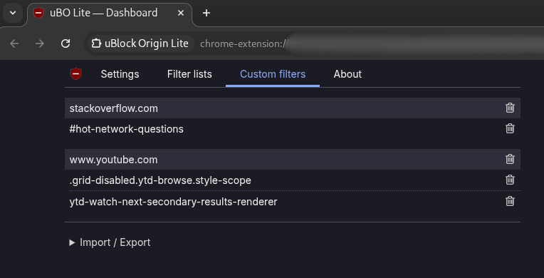
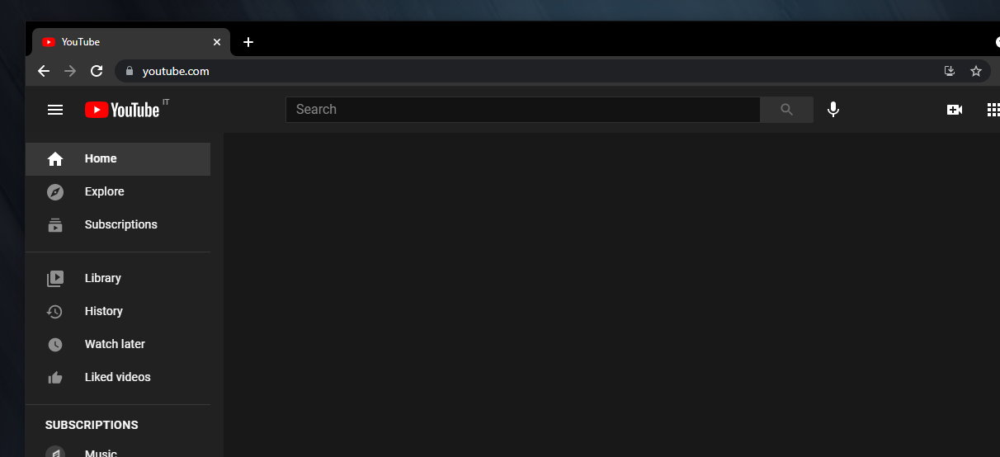

# ublock-filters

[**uBlock Origin**](https://ublockorigin.com/) is an extremely powerful and useful **ad-blocker** browser extension for _Google Chrome_, _Mozilla Firefox_, and other browsers. Among other things, it allows you to block **specific content** on websites by defining a list of custom filter rules.

Here is my personal filters list to avoid distractions:

```
! 2022-01-27 https://www.youtube.com - disable video suggestions
www.youtube.com##ytd-watch-next-secondary-results-renderer
www.youtube.com##.grid-disabled.ytd-browse.style-scope

! 2021-07-26 https://stackoverflow.com - disable hot network questions
stackoverflow.com###hot-network-questions
```

If you use the standard (non-Lite) _uBlock Origin_ browser extension, these rules should be put in the _uBlock Dashboard_ &rarr; **My filters** section:


If you use the _uBlock Origin Lite_ browser extension, these rules should be put in the _uBO Lite Dashboard_ &rarr; **Custom filters** section:



The results are the following:




