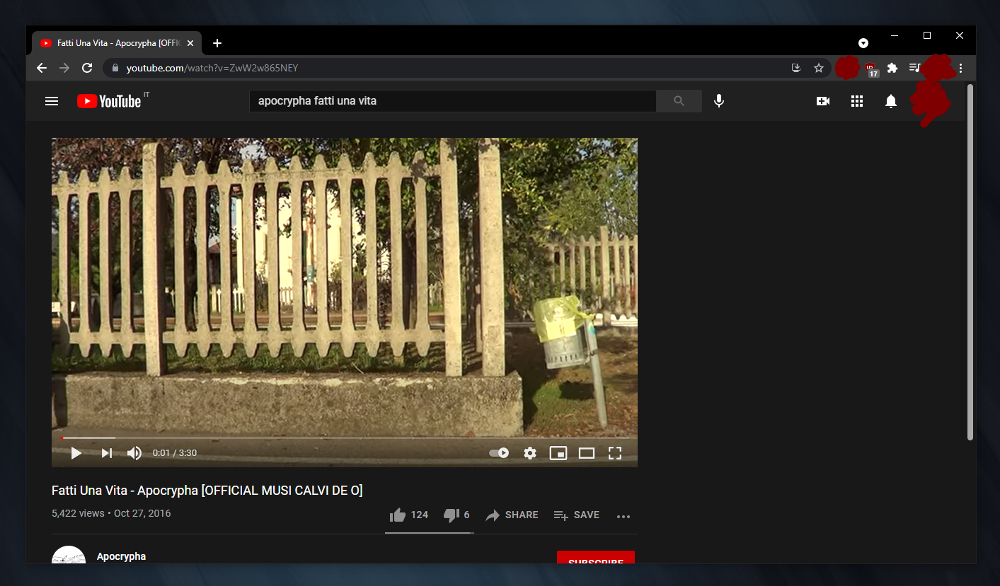

# distraction-free-yt

[**uBlock Origin**](https://github.com/gorhill/uBlock) is an extremely useful ad-blocker browser extension for *Google Chrome* (and other browsers). Among other things, it lets the user block **specific content** on websites by defining a list of custom filter rules.

Here is a list to hide **YouTube video suggestions** (to avoid distractions):

```
! 2021-05-21 https://www.youtube.com
www.youtube.com##ytd-watch-next-secondary-results-renderer.ytd-watch-flexy.style-scope > .ytd-watch-next-secondary-results-renderer.style-scope
www.youtube.com##.grid-disabled.grid.ytd-browse.style-scope > .ytd-two-column-browse-results-renderer.style-scope
```

These rules should be but in the *uBlock Dashboard* &rarr; **My filters** section, like shown here:


The result is the following:



