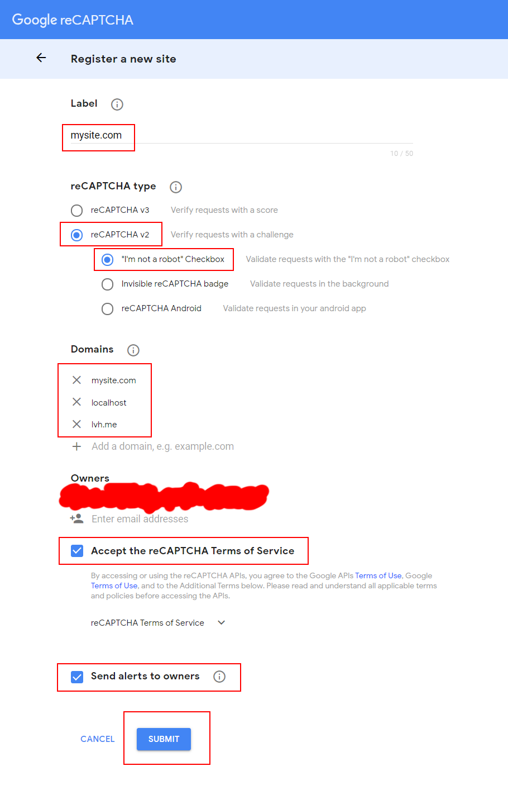

# php-recaptcha

Simple example of how to use **Google reCAPTCHA v2** with **PHP**.

> **Important**: this has been tested with **PHP 8.0.8**.

Useful video tutorial (_not mine_): https://www.youtube.com/watch?v=xyOu0b6R3m0

## Step 1: Create the key pair

Log in to your _Google Account_, then go to https://www.google.com/recaptcha/admin/create and create a new **reCAPTCHA site**.

Remember to add the desired **domains** to the list.

## Step 2: Use it

See the [`index.php`](index.php) file for an example. Remember to replace the **site key** and the **secret key** with yours.
