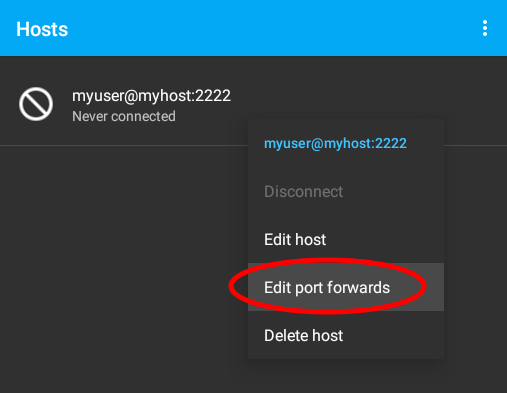

# connectbot-port-forwarding

This guide explains how to set up an **SSH port forwarding** tunnel using **ConnectBot** (on _Android_).

First of all, make sure you have the [ConnectBot](https://connectbot.org/) app installed on your device ([available in the Google Play Store](https://play.google.com/store/apps/details?id=org.connectbot)).

Some global `Settings` you may want to set:

- Audible bell: off
- Vibrate on bell: off

From the `Manage Pubkeys` menu, create a new **pubkey** with the following settings:

- Nickname: choose a name for the key, e.g. `alice-phone-connectbot`
- Type: `Ed25519`
- Password: set a secure one and make sure you don't forget it
- Load key on start: off
- Confirm before use: on

Copy the **public key** string and paste it inside the `authorized_keys` of your remote host.

From the main screen, add a new **host** with the following details:

- Address: specify username + hostname + SSH port in the suggested format
- Nickname: same as the address
- Use pubkey authentication: select the pubkey created previously
- Start shell session: off
- Stay connected: on
- Close on disconnect: on

From the main screen, long press on the created host and select `Edit port forwards`.

Add your port forwarding rules to the list.

From the main screen, tap on the host to **connect** to it. The **host key fingerprint** will be shown. Make sure it's what you expect, then click `Yes` to confirm.

Enter the **pubkey password** when prompted.

If the connection is successful, the **screen should clear** and stay idle, like this:

Now you can try to access your forwarded port and see if it works.

