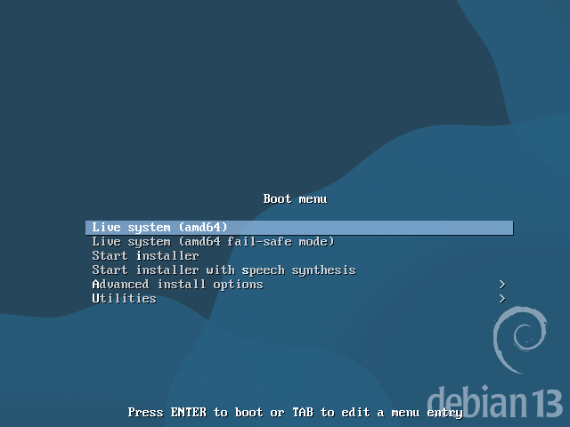
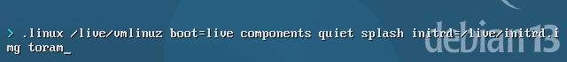
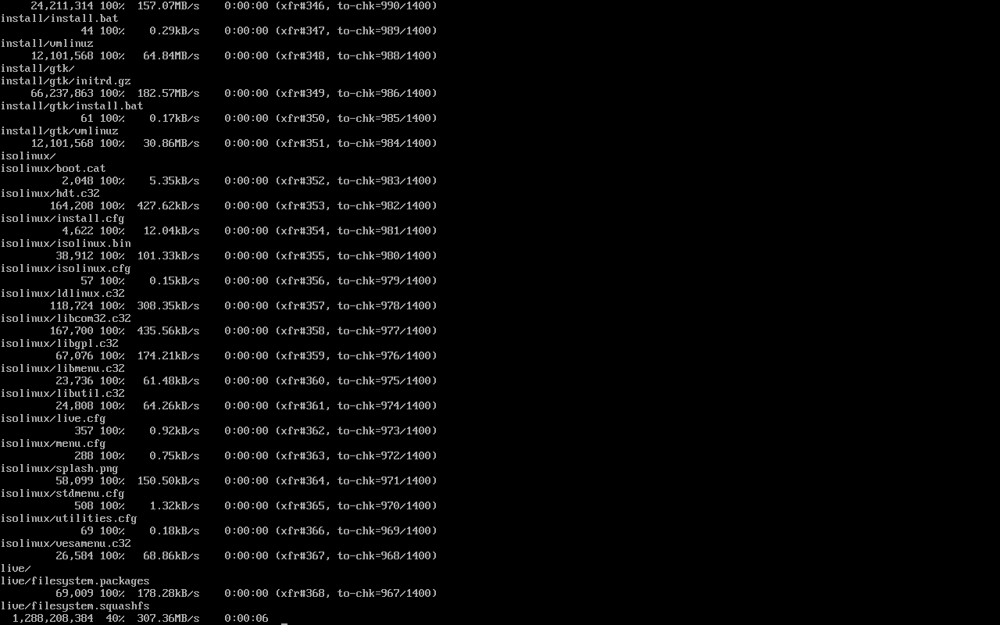
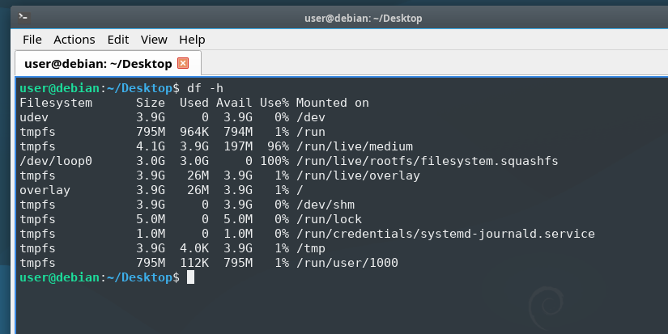

# debian-boot-to-ram

In this guide we will see how to boot a **Debian** Live ISO **completely from RAM**, so that you will be able to remove the USB pendrive after booting and the live system will continue to function normally.

> **Note**: this guide is inspired by the following video: [Boot Linux Completely in RAM](https://www.youtube.com/watch?v=EtJETFQat0o&t=354s).

First of all, make sure you have a real **live** Debian ISO (not `netinst`). This guide was tested with :cd: `debian-live-13.2.0-amd64-lxqt.iso`.

**Flash** the ISO file onto a **USB pendrive**, for example using [Rufus](https://rufus.ie/en/). Then **boot** from the pendrive.

From the boot menu, make sure the `Live system` option (the first one) is selected, and press `e` (if on a UEFI-based system) or `TAB` (if on a legacy BIOS system) to **edit the entry**. Add the **`toram` option** to the `linux ...` line, like this:

Then press `F10` (UEFI) or `ENTER` (BIOS) to boot.

> :warning: **Warning**: make sure the PC has **enough RAM** to store the full Debian OS image, otherwise the `toram` option will simply be ignored. In my case (with the aforementioned ISO file) more than 4 GB were needed, so I used a PC with 8 GB of RAM.

The boot process **will take a while**, as the entire OS image needs to be copied to RAM.

> :bulb: **Tip**: if you want to see the **progress** while the system is booting, you can **press ESC** during the Debian boot splash screen.

Once the system is booted, you should be able to **safely unmount and unplug the USB stick**.

You can verify that the system is fully running from RAM with the `df -h` command:

You should see that the filesystem for `/run/live/medium` is `tmpfs`, and you shouldn't see your USB pendrive mounted anywhere anymore.
