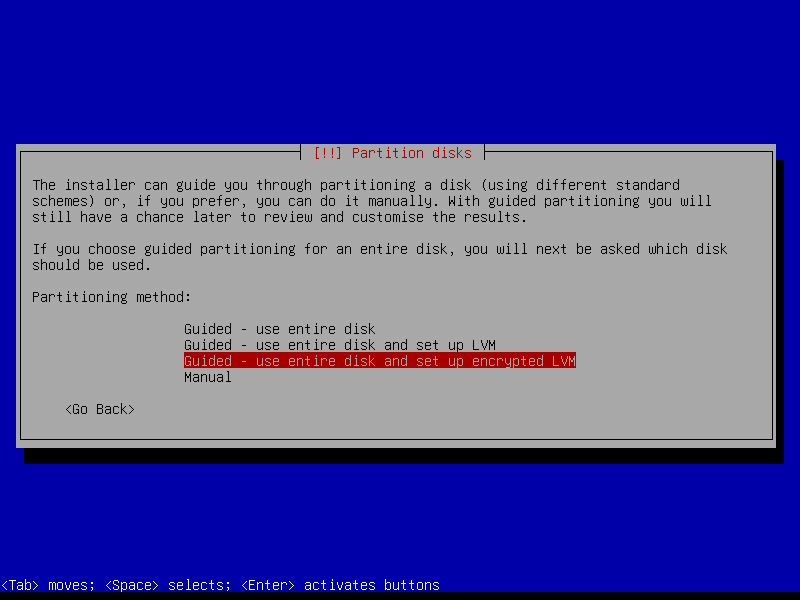
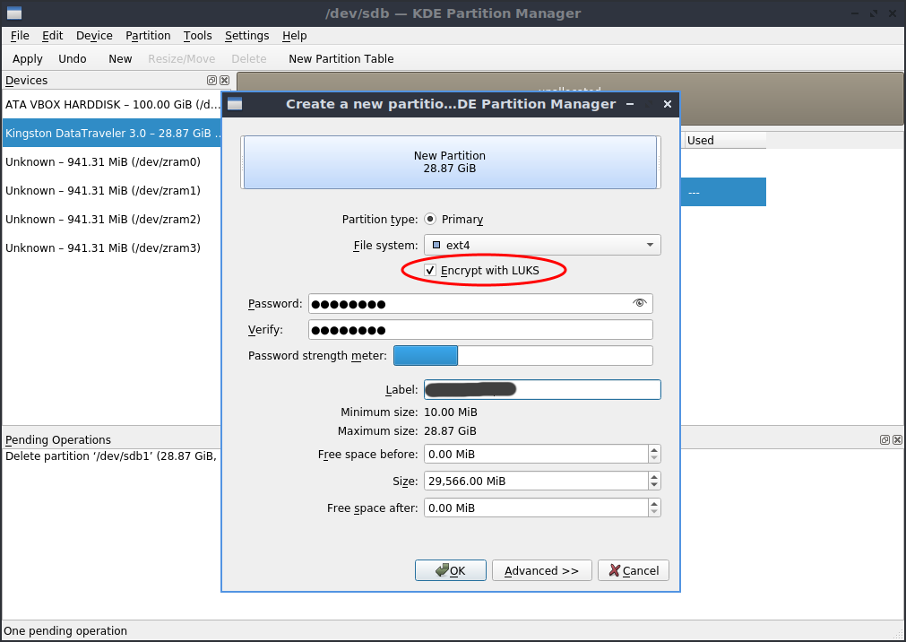
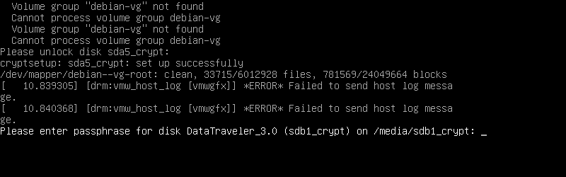
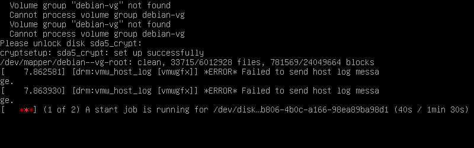

# debian-luks

**LUKS** (_Linux Unified Key Setup_) is a **disk encryption** specification intended for _Linux_.

In this guide we will see how to work with LUKS encryption on **Debian**.

## Debian full system encryption

You can choose to **encrypt your whole Debian installation** during the OS setup process. To do this, when the `Partition disks` screen is displayed, select the `Guided - use entire disk and setup encrypted LVM` option:



You will then be asked for the **passphrase** later in the process; it will be required **at every boot** (just like [_VeraCrypt_'s full-disk encryption](https://veracrypt.eu/en/System%20Encryption.html)).

## Creating an encrypted partition

There are a lot of **graphical partitioning tools** that support creating _LUKS_ encrypted partitions. Example with [KDE Partition Manager](https://apps.kde.org/partitionmanager/) on _Lubuntu_ live:



Also [GNOME Disks](https://apps.gnome.org/DiskUtility/) supports creating encrypted partitions.

If you want to use the **command line** instead (e.g. for systems without a graphical interface):

```bash
sudo cryptsetup luksFormat /dev/sdb1
sudo cryptsetup open /dev/sdb1 sdb1-crypt
sudo mkfs.ext4 /dev/mapper/sdb1-crypt
sudo cryptsetup close sdb1-crypt
```

> **Note**: to install the `cryptsetup` tool on _Debian 12_ (_bookworm_): `sudo apt update && sudo apt install -y cryptsetup`

> **Note**: the `cryptsetup luksFormat` and `cryptsetup open` commands will interactively ask you for the passphrase.

> **Note**: the name `sdb1-crypt` is just an example; you can choose any name you want.

You can also do the same using an **`.img` file** instead of a real partition:

```bash
dd if=/dev/zero of=myimage.img bs=1M count=1024 status=progress
sudo cryptsetup luksFormat myimage.img
```

> **Note**: you might want to try adding `oflag=direct` to the `dd` command; it could make it faster.

## Mounting an encrypted partition

To **mount** an encrypted partition, you can use one of the **GUI tools** [mentioned above](#creating-an-encrypted-partition).

If you want to use the **command line** instead (e.g. for systems without a graphical interface):

```bash
sudo cryptsetup open /dev/sdb1 sdb1-crypt
sudo mkdir -v /mnt/sdb1-crypt
sudo mount /dev/mapper/sdb1-crypt /mnt/sdb1-crypt
```

> **Note**: the `cryptsetup open` command will interactively ask you for the passphrase.

To **unmount** the partition:

```bash
sudo umount /mnt/sdb1-crypt
sudo rm -rv /mnt/sdb1-crypt
sudo cryptsetup close sdb1-crypt
```

## Mounting at system startup

You can have a LUKS encrypted partition **mounted automatically at system boot**. Here's how to do it.

Let's assume that our encrypted partition is `/dev/sdb1`.

First of all, obtain the **UUID** of the partition:

```bash
sudo blkid -sUUID -ovalue /dev/sdb1
```

Create the **mountpoint**:

```bash
sudo mkdir -v /mnt/sdb1-crypt
```

Add the following line to `/etc/crypttab`, replacing the UUID with the correct value:

```
sdb1-crypt   UUID=a1b2c3d4-a1b2-c3d4-e5f6-a1b2c3d4e5f6   none   luks,discard
```

> **Note** (from `crypttab` docs): `discard` allows **discard** requests to be **passed through** the encrypted block device. This improves performance on SSD storage but has security implications.

Add the following line to `/etc/fstab`:

```
/dev/mapper/sdb1-crypt   /mnt/sdb1-crypt   ext4   defaults   0   0
```

Then **reboot** the system for the changes to take effect.

The passphrase of the encrypted partition **will now be asked** at every boot:



> **Note**: if you set up _N_ encrypted partitions in `/etc/crypttab`, you **will be asked for _N_ passphrases** at boot, even if some of the partitions share the same passphrase.

If the `/dev/sdb1` partition is **not found** at boot (e.g. it is on an external hard-drive that is not connected to the system), the operating system **won't start**:



## Links

- [Mount encrypted volumes from command line - Ask Ubuntu](https://askubuntu.com/questions/63594/mount-encrypted-volumes-from-command-line/63598#63598)
- [How to auto mount LUKS device (encrypted partition) using fstab in Linux - GoLinuxCloud](https://www.golinuxcloud.com/mount-luks-encrypted-disk-partition-linux/)
- [Find UUID of Storage Devices in Linux - Linux Hint](https://linuxhint.com/uuid_storage_devices_linux/)
- [crypttab - Configuration for encrypted block devices](https://www.freedesktop.org/software/systemd/man/crypttab.html)
- [Using a single passphrase to unlock multiple encrypted disks at boot - Unix and Linux Stack Exchange](https://unix.stackexchange.com/questions/392284/using-a-single-passphrase-to-unlock-multiple-encrypted-disks-at-boot/392286#392286)
- [/mnt: Mount point for a temporarily mounted filesystem - Filesystem Hierarchy Standard](https://www.pathname.com/fhs/pub/fhs-2.3.html#MNTMOUNTPOINTFORATEMPORARILYMOUNT)
