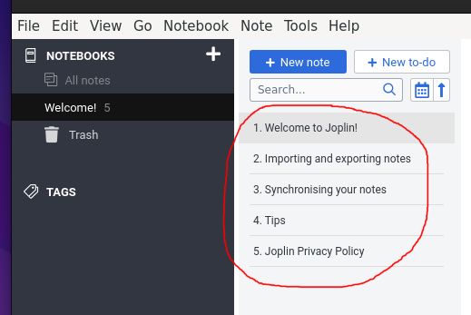
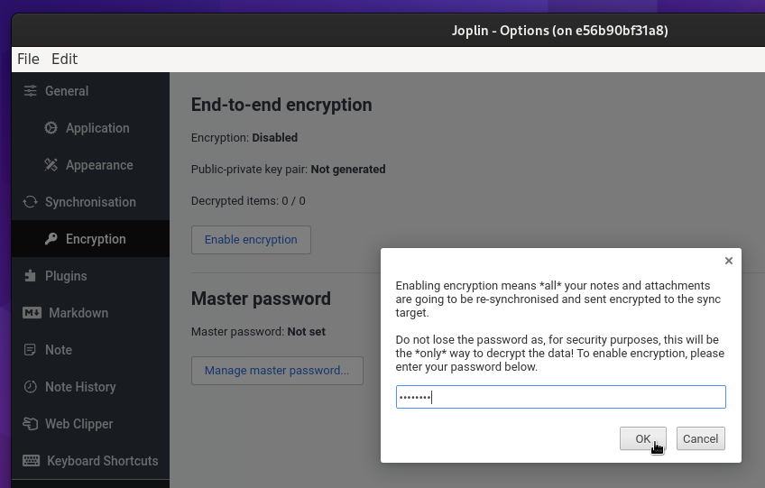
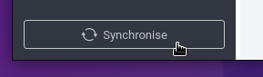
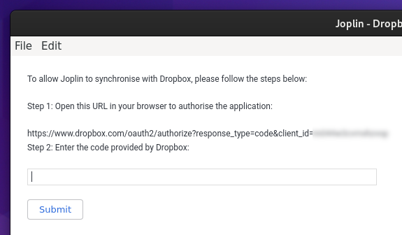
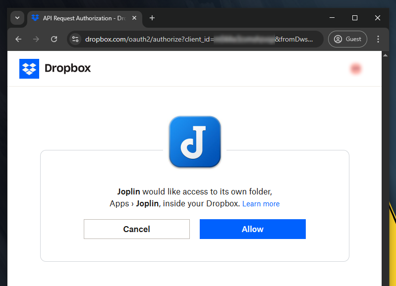
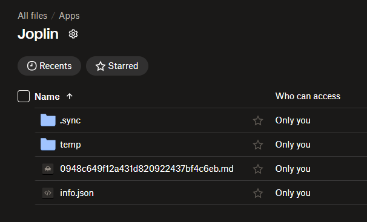
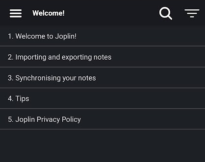
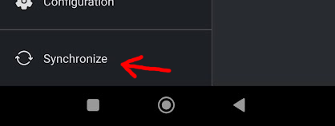
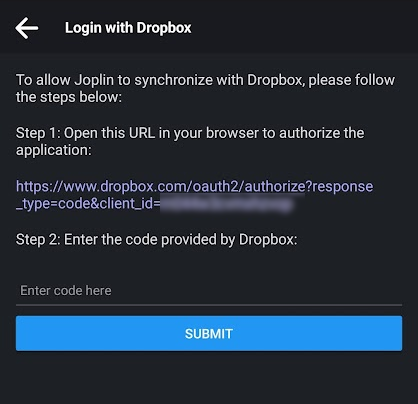
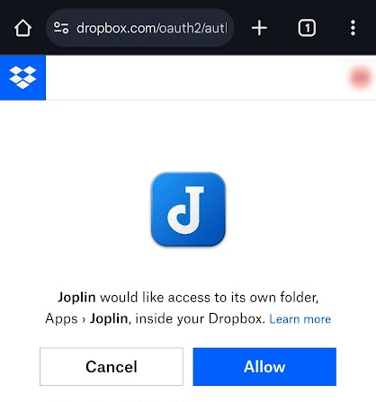

# joplin-dropbox-setup

This guide explains how to set up **[Joplin](https://joplinapp.org/)** **end-to-end encrypted** synchronization with **[Dropbox](https://www.dropbox.com/)**, both on a **PC** (with _Joplin Desktop_) and on an _Android_ **smartphone** (with the _Joplin Mobile_ app).

## Upload initial data to Dropbox

It's recommended to use **Joplin Desktop** to **create your initial data** (notes, attachments, notebooks, etc.) because, unlike _Joplin Mobile_, it makes it much easier to start **from scratch**, i.e. without unwanted default notes and attachments.

You can run _Joplin Desktop_ in a Docker container using [`dmotte/docker-xfwd`](https://github.com/dmotte/docker-xfwd):

```bash
docker build -t img-joplin01:latest - << 'EOF'
FROM docker.io/dmotte/xfwd:latest
RUN apt-get update && apt-get install -y curl libasound2 && \
    curl -fLo /joplin.deb https://github.com/laurent22/joplin/releases/latest/download/Joplin-3.2.13.deb && \
    apt-get install -y /joplin.deb && rm /joplin.deb && rm -rf /var/lib/apt/lists/*
EOF

docker run -d --name=joplin01 -v/tmp/.X11-unix/X0:/opt/xfwd/host.sock:ro -v"${XAUTHORITY:?}:/opt/xfwd/host.xauth:ro" img-joplin01:latest

docker exec -it -{u,eUSER=}mainuser -{eHOME=,w}/home/mainuser joplin01 joplin --no-sandbox
```

Once the application opens, you will notice that some **default data** is already present:



To completely **remove it**, go to `Tools` &rarr; `Options` &rarr; `Synchronization` and click on `Show Advanced Settings`, then on the `Delete local data and re-download from sync target` button. Since we didn't set up a synchronization target yet, Joplin will just remove all the data.

Now we need to enable **end-to-end encryption**: go to `Tools` &rarr; `Options` &rarr; `Encryption` and click on `Enable encryption`, enter a password and click `OK`.



Now you can **create your initial data**.

To **set up synchronization** with your _Dropbox_ account, go to `Tools` &rarr; `Options` &rarr; `Synchronization`, set the `Synchronization target` to `Dropbox` and click `OK`. Then go back to the main screen and click on the `Synchronize` button:



Follow the procedure to **authorize the application**:





Once the synchronization is set up, _Joplin Desktop_ will synchronize your data to the **`Apps/Joplin` folder** in your _Dropbox_ account:



## Download zip backup from Dropbox

You can download a backup (**zip** file) of your **encrypted Joplin data** from _Dropbox_ at any time: simply locate the **`Apps/Joplin` folder** in the _Dropbox_ web interface, click on the folder's **three-dot icon** (`More`) and then on `Download`:


## Set up Joplin Mobile

:warning: **Important**: as a first step, download a **backup of the `Apps/Joplin` folder** from your _Dropbox_ account (see the [Download zip backup from Dropbox](#download-zip-backup-from-dropbox) section). It will be needed later.

Install the **[Joplin Mobile](https://play.google.com/store/apps/details?id=net.cozic.joplin)** _Android_ app on your smartphone and open it. You'll notice that some **default data** is already present:



Let's keep it there for now; we will remove it later.

To **set up synchronization** with your _Dropbox_ account, go to `Configuration` &rarr; `Synchronization`, set the `Synchronization target` to `Dropbox` and click `OK`. Then go back to the main screen and click on the `Synchronize` button:



Follow the procedure to **authorize the application**:





TODO encryption

After you **run the first synchronization**, you'll notice that some items are created in the Dropbox `Apps/Joplin` folder: they are the **default notes and attachments** uploaded from the _Joplin Mobile_ app:

TODO img/screen12-mobile-TODO.png

To get rid of them, after the first sync is completed, **replace all the content of the `Apps/Joplin` _Dropbox_ folder** with the content of the **zip file** you downloaded previously, and then run the synchronization again. This should force the _Joplin Mobile_ app to delete such unwanted items from its local storage.

TODO img/screen13-mobile-TODO.png

> **Note**: we use this custom approach to **forcefully delete** the default _Joplin Mobile_ notes and attachments because simply deleting them manually from the app **would only mark them as deleted**, but they would still remain in both the app's local storage and _Dropbox_. This is a quirk of how _Joplin_ handles deletions.

## Read zip backup using Joplin Desktop

TODO extract the zip file to a directory

TODO start _Joplin Desktop_ in a Docker container like described in the previous section, but mount the directory with the `-v ...` Docker option

TODO set sync target to local filesystem directory

TODO force pull with `Delete local data and re-download from sync target`
