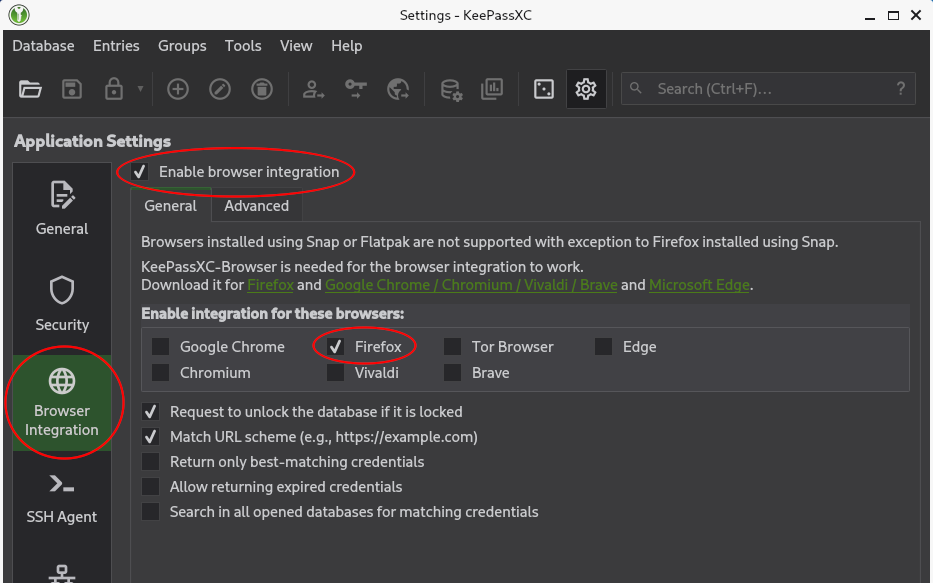
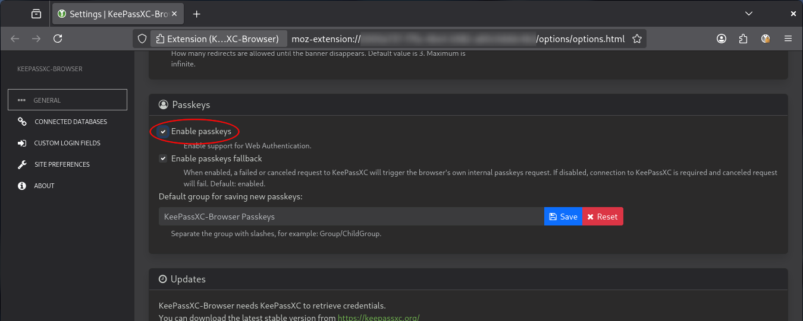
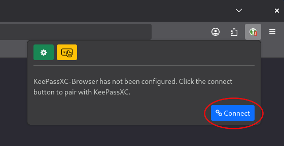
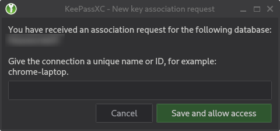
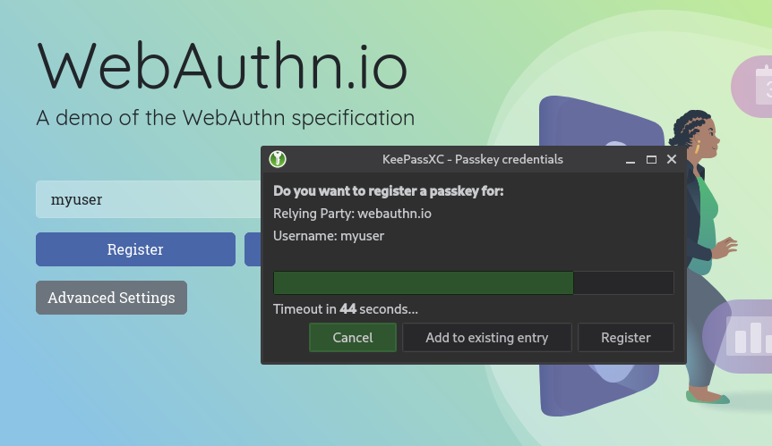
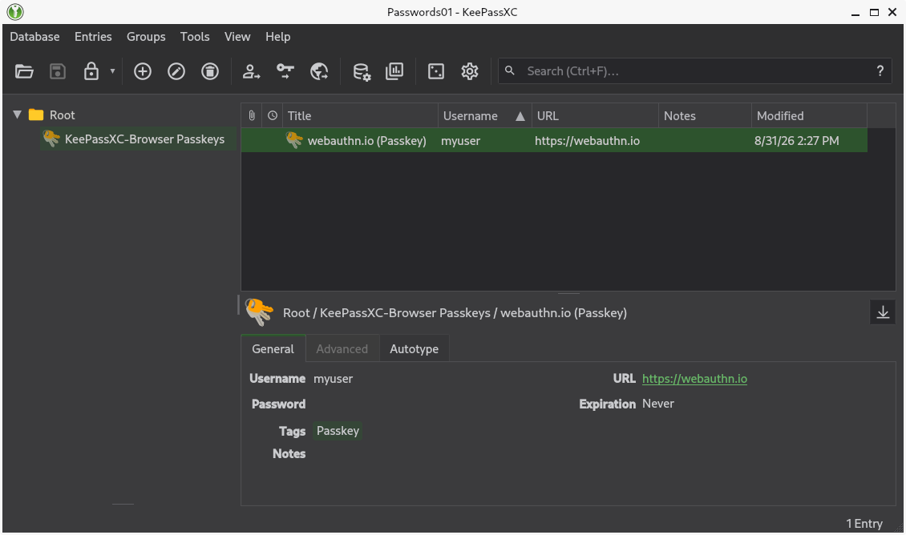
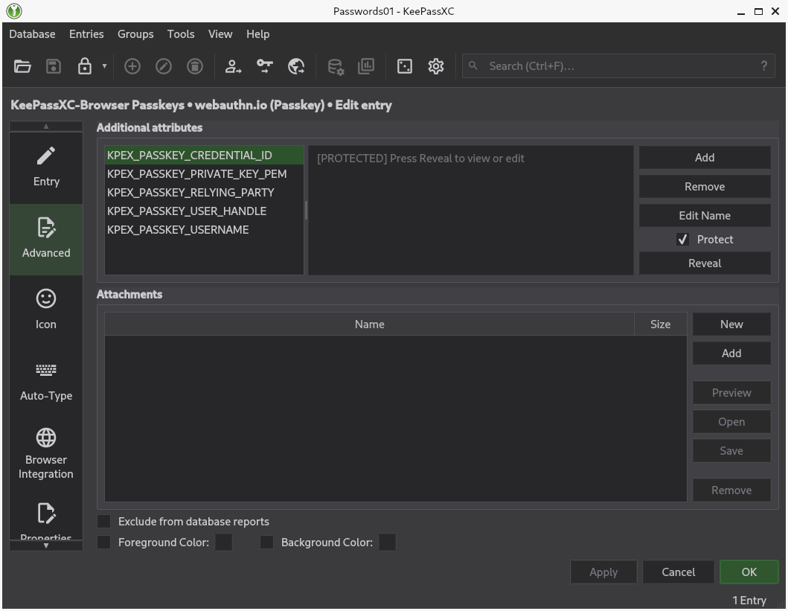

# keepassxc-webauthn-passkeys

In this tutorial we will see how to use **WebAuthn Passkeys** with the **KeePassXC-Browser** extension for _Chromium_ / _Google Chrome_ / _Mozilla Firefox_, on **Debian 13** (_trixie_).

First of all, install the required **system packages**:

```bash
sudo apt update && sudo apt install -y firefox-esr keepassxc-full webext-keepassxc-browser
```

From the _KeePassXC_ settings, enable **Browser Integration** for the browser(s) you want to use (e.g. _Firefox_):



Now open a KeePass database in _KeePassXC_ and, while leaving the application **running in the background**, open your browser.

From the _KeePassXC-Browser_ extension settings, check the **Enable passkeys** option:



Now **configure the connection** between the _KeePassXC-Browser_ extension and the database opened in the _KeePassXC_ application, by clicking the `Connect` button in the extension's UI:



A _KeePassXC_ window like this should pop up:



The connection details will be **saved in the KeePass database file**. The connection name should basically represent the _KeePassXC-Browser_ instance.

Now go to a website that supports WebAuthn Passkeys, such as [WebAuthn.io](https://webauthn.io/), and try to **register a new passkey**. A _KeePassXC_ window like this should pop up:



After that, if the registration was successful, you should see the **related entry** in the KeePass database:





## Links

- [Debian -- Details of package webext-keepassxc-browser in trixie](https://packages.debian.org/stable/webext-keepassxc-browser)
- [KeePassXC Passkeys Without Big Tech! - YouTube](https://www.youtube.com/watch?v=L7uXFJfxf80&t=353s)
