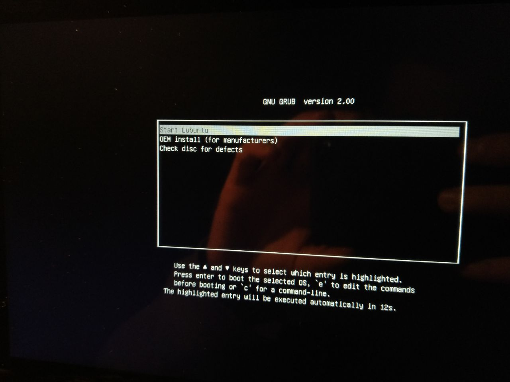

# linux-x64-grub-uefi-32bit

This guide explains how to boot a **64-bit** (`amd64`) **Linux live USB** on a device that has an **amd64 processor** but a **32-bit UEFI**. An example of this kind of device is the [ASUS Transformer Book T100TA](https://www.asus.com/it/supportonly/t100ta/helpdesk_download/).

In my test I used the **Lubuntu 18.10 amd64 ISO file**, and I flashed it onto a USB stick using [Rufus](https://rufus.ie/en/), with the following settings:

- Partition scheme: `GPT`
- Target system: `UEFI (non CSM)`

Once you have your Linux 64-bit live USB pendrive ready, **download** the following `bootia32.efi` file, which is basically **32-bit GRUB**:

https://github.com/hirotakaster/baytail-bootia32.efi/blob/master/bootia32.efi

Check that the `sha256sum` is correct:

```bash
echo c4078bdc315cdd974fdb0986b7b73a31539e34bf0644e9d7c64cde925f73300b bootia32.efi | sha256sum -c
```

> **Note**: some people say that you can also get 32-bit GRUB from a 32-bit Linux ISO file. See https://github.com/hirotakaster/baytail-bootia32.efi/issues/2#issue-1096028306

Then copy the `bootia32.efi` file to the **`/EFI/BOOT` directory** of the Linux 64-bit live USB stick you just flashed.

Finally, insert the USB stick into your device and turn it on. The GRUB menu should appear:



## Links

- [boot - Ubuntu on 32-bit UEFI (only) based tablet pc - Ask Ubuntu](https://askubuntu.com/questions/775498/ubuntu-on-32-bit-uefi-only-based-tablet-pc/775507#775507)
