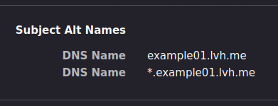

# openssl-https

This guide explains how to use **OpenSSL** to **generate certificates** that can be used by **HTTPS** webservers.

We will see both the [Self-signed certificate](#self-signed-certificate) and the [CA-signed certificate](#ca-signed-certificate) scenarios.

> **Note**: we will use `*.lvh.me` domains in the examples, as they always resolve to `127.0.0.1` (localhost).

## Self-signed certificate

Although using a **self-signed certificate** for your web server is generally **discouraged**, creating one is actually quite simple, as it basically involves only a single command:

```bash
openssl req -x509 -newkey rsa:4096 -keyout server.key -nodes -out server.crt -days 365 -subj '/CN=example01.lvh.me' -addext 'subjectAltName=DNS:example01.lvh.me,DNS:*.example01.lvh.me' -addext 'basicConstraints=critical,CA:FALSE'
```

> **Note**: see the [Caveats](#caveats) section for more details about the **certificate generation** command.

Note that browsers always show a **warning** message like this one for self-signed certificates (e.g. _Firefox_):


See the [**Testing**](#testing) section to check that your certificate works as intended.

## CA-signed certificate

In order to create a **CA-signed certificate**, let's create a **CA** (_Certificate Authority_) first:

```bash
openssl req -x509 -newkey rsa:4096 -keyout ca.key -nodes -out ca.crt -days 365 -subj '/CN=My CA'
```

Then we need to create a **CSR** (_Certificate Signing Request_):

```bash
openssl req -newkey rsa:4096 -keyout server.key -nodes -out server.csr -subj '/CN=example01.lvh.me'
```

We also need a `ca.srl` file, which will keep track of the **serial numbers** assigned to certificates issued by the CA:

```bash
openssl rand -hex 16 > ca.srl
```

> **Note**: although the serial number maximum length is **20 bytes**, we generate only **16 random bytes** as the initial serial number, because the serial **must always be positive**, so we don't want the first byte to be in the `80`-`FF` range.

Finally, we can **sign the CSR** and get the **signed certificate**:

```bash
openssl x509 -req -in server.csr -CA ca.crt -CAkey ca.key -CAserial ca.srl -out server.crt -days 365 -extfile <(echo 'subjectAltName=DNS:example01.lvh.me,DNS:*.example01.lvh.me'; echo 'basicConstraints=critical,CA:FALSE')
```

> **Note**: see the [Caveats](#caveats) section for more details about the **certificate signing** command.

> **Note**: as you may have noticed, we need to specify the **validity days** and **extensions** in the final **signing command** instead of the _CSR_ creation one.

See the [**Testing**](#testing) section to check that your certificate works as intended.

## Testing

You can use the following commands to quickly **analyze** the generated files:

```bash
openssl x509 -in server.crt -noout -text
openssl rsa -in server.key -noout -text
openssl req -in server.csr -noout -text
```

You can also start a **simple HTTPS web server** to test a certificate, like this:

```bash
openssl s_server -cert server.crt -key server.key -accept 127.0.0.1:4433 -www
```

Then you can open a **web browser** and head over to https://example01.lvh.me:4433/.

> **Note**: we are able to use the TCP port `4433` or any other port we want, because **X.509 certificates** aren't bound to specific ports, but to **domain names** (or **IP addresses**) instead.

For production environments, you may also want to generate and use custom **Diffie-Hellman (DH) parameters** instead of relying on default ones:

```bash
openssl dhparam -out dhparam.pem 4096
openssl s_server -cert server.crt -key server.key -dhparam dhparam.pem -accept 127.0.0.1:4433 -www
```

## Caveats

We set the **SANs** (_Subject Alternative Names_) to create a **wildcard certificate** that also covers all the `*.example01.lvh.me` subdomains. You can also see that by inspecting the certificate details in a web browser (e.g. _Firefox_):



We create a **leaf certificate** by setting the `CA` basic constraint to `FALSE`. You can also see that by inspecting the certificate details in a web browser (e.g. _Firefox_):


That prevents users from adding the server certificate to their browsers as a trusted CA:


## Links

- [Traefik and self signed SSL certs - wekan/wekan Wiki](https://github.com/wekan/wekan/wiki/Traefik-and-self-signed-SSL-certs)
- [X.509 - Wikipedia](https://it.wikipedia.org/wiki/X.509)
- [openssl - OpenSSL command line program - OpenSSL Documentation](https://www.openssl.org/docs/manmaster/man1/openssl.html)
- [openssl-cmds - OpenSSL Documentation](https://www.openssl.org/docs/manmaster/man1/req.html)
- [How To Create a Self-Signed SSL Certificate for Nginx on Debian 10 - DigitalOcean](https://www.digitalocean.com/community/tutorials/how-to-create-a-self-signed-ssl-certificate-for-nginx-on-debian-10)
- [How to Be Your Own Certificate Authority (with Pictures) - wikiHow](https://www.wikihow.com/Be-Your-Own-Certificate-Authority)
- [OpenSSL Generate CSR non-interactive - Raymii.org](https://raymii.org/s/snippets/OpenSSL_generate_CSR_non-interactive.html)
- [Unable to use -subj with Windows Git Bash - Issue #8795 - openssl/openssl - GitHub](https://github.com/openssl/openssl/issues/8795)
- [Self Signed Certificate with Custom Root CA - GitHub](https://gist.github.com/fntlnz/cf14feb5a46b2eda428e000157447309)
- [How to setup your own CA with OpenSSL - GitHub](https://gist.github.com/Soarez/9688998)
- [openssl-req, req - PKCS#10 certificate request and certificate generating utility - OpenSSL Documentation](https://www.openssl.org/docs/man1.0.2/man1/openssl-req.html)
- [Creating the Root CA - Roll Your Own Network](https://roll.urown.net/ca/ca_root_setup.html)
- [x509v3_config - X509 V3 certificate extension configuration format - OpenSSL Documentation](https://docs.openssl.org/1.1.1/man5/x509v3_config/)
- [s_server - OpenSSL Documentation](https://docs.openssl.org/1.1.1/man1/s_server/)
