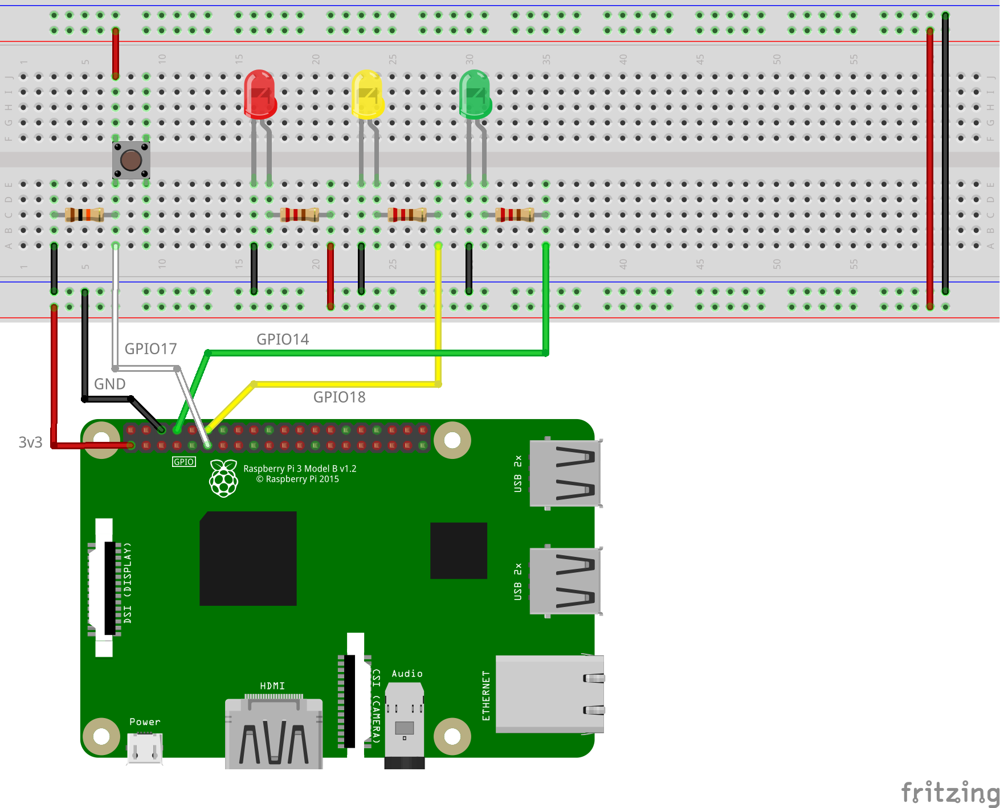

# raspi-safe-shutdown


Simple daemon service application for _Raspberry Pi_ to handle a **safe shutdown button** with an indicator LED.

:warning: **Disclaimer**: I am not responsible for any possible damage caused to your boards.

> **Important**: this has been tested on a **Raspberry Pi 3 B** with **[Raspberry Pi OS](https://www.raspberrypi.com/software/operating-systems/) Lite** (release date: _2024-03-12_), and depends only on **system packages** (from APT). See [`install.sh`](install.sh) for further details. If you want to double-check the versions of the Python libraries used, see [`requirements.txt`](requirements.txt).

## Demo

Demonstration video ([`demo.mp4`](demo.mp4)):

https://github.com/dmotte/misc/assets/37443982/3d33ca51-1fe9-4a12-b926-77b68fae8df9

## Circuit

To use this application you just need to connect two components to your Raspberry Pi via GPIO: an **LED** and a **button**. However, I also find very useful to know when the board is powered and when the operating system is running. This can be achieved by connecting two more LEDs.

The ideal scenario is therefore the following:

- The **button** should be connected to the `GPIO_GEN0` pin (`BCM #17`)
- The **red LED** (optional) should be connected to **3v3**
  - it is ON when the board is powered, even if the OS is not running
- The **yellow LED** should be connected to the `GPIO_GEN1` pin (`BCM #18`)
  - it is the indicator LED for the _raspi-safe-shutdown_ application
- The **green LED** (optional) should be connected to the `UART0_TXD` pin (`BCM #14`)
  - it is ON only when the operating system is up and running

To make the (optional) green LED work as explained, you need to have **Serial communication** enabled on the Raspberry Pi. To enable it, log in and execute the following command:

```bash
sudo raspi-config nonint do_serial 0
```

Then reboot the Raspberry Pi to make the changes effective:

```bash
sudo reboot
```



## Installation

```bash
sudo RASPI_SAFE_SHUTDOWN_RESTART=when-changed bash install.sh
```
