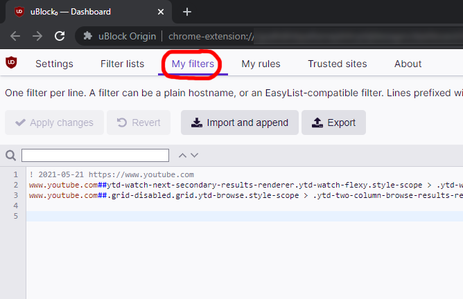
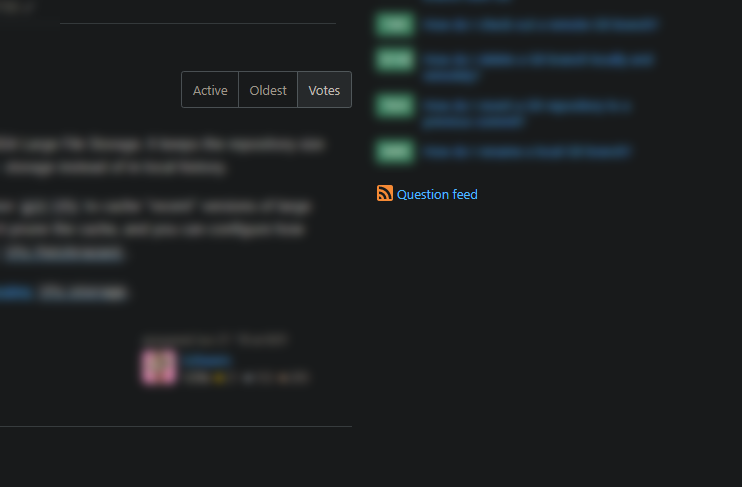

# ublock-filters

[**uBlock Origin**](https://github.com/gorhill/uBlock) is an extremely useful **ad-blocker** browser extension for *Google Chrome* (and other browsers). Among other things, it lets the user block **specific content** on websites by defining a list of custom filter rules.

Here is my personal filters list to avoid distractions:

```
! 2021-05-21 https://www.youtube.com - disable video suggestions
www.youtube.com##ytd-watch-next-secondary-results-renderer.ytd-watch-flexy.style-scope > .ytd-watch-next-secondary-results-renderer.style-scope
www.youtube.com##.grid-disabled.grid.ytd-browse.style-scope > .ytd-two-column-browse-results-renderer.style-scope

! 2021-07-26 https://stackoverflow.com - disable hot network questions
stackoverflow.com###hot-network-questions
```

These rules should be but in the *uBlock Dashboard* &rarr; **My filters** section, as shown below:



The results are the following:



